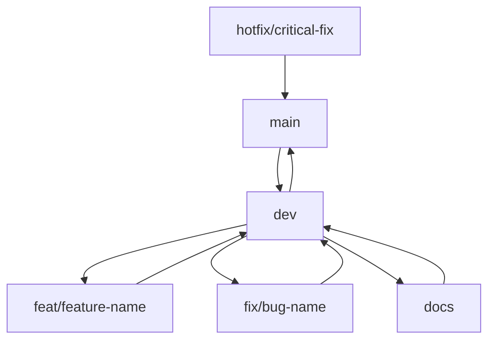

# Git Workflow ve Commit Standartları

## 🌐 Remote Repository

**origin** → GitHub push/pull işlemleri için kullanılan varsayılan remote repository adı

---

## 🌳 Ana Branch Yapısı

### `main`
- **Amaç**: Stabil, yayınlanabilir kod tabanı
- **Merge Kaynağı**: Sadece `dev` veya `release` branchlerinden
- **Durum**: Production-ready kod

### `dev` 
- **Amaç**: Aktif geliştirme ortamı
- **Merge Kaynağı**: Tüm `feat/` ve `fix/` branchlerinin birleşim noktası
- **Test**: Düzenli entegrasyon testleri burada yapılır

### `docs`
- **Amaç**: Dokümantasyon yönetimi (GDD, Flowchart, Mimari tasarım)
- **Workflow**: İş tamamlandıktan sonra `dev` ile merge edilir

---

## 🔀 Alt Branch Tipleri

### Feature Branches (`feat/`)
**Kullanım**: Yeni özellik geliştirme

```
feat/player-movement
feat/inventory-system
feat/ui-menu-system
```

### Fix Branches (`fix/`)
**Kullanım**: Hata düzeltme ve küçük optimizasyonlar
- Unity tabanlı olmayan, bağımsız düzeltmeler için kullanılır

### Test Branches (`test/`)
**Kullanım**: Riskli, deneysel sistemler
- Kararsız AI algoritmaları
- Alternatif mimari denemeleri
- Proof of concept çalışmaları

### Hotfix Branches (`hotfix/`)
**Kullanım**: Production'da kritik bug düzeltmeleri *(Opsiyonel)*
- `main`'den açılır
- Hem `main` hem `dev`'e merge edilir

---

## 📋 Branch Kullanım Kuralları

### 1. Proje Başlangıcı
```bash
git commit -m "main: Project Created"
```
- Temel proje yapısı `main` branchine işlenir

### 2. Dokümantasyon Süreci (`docs`)
- GDD, Mimari Flowchart, Base System şemaları eklenir
- Her değişiklik `docs` branchinde push edilir
- İş tamamlandığında `dev` branchine merge edilir

### 3. Geliştirme Süreci (`dev`)
- Temel mimari, klasör yapısı ve editor ayarları oluşturulur
- Tüm `feat/` ve `fix/` branchleri güncel `dev` tabanlı açılmalıdır

### 4. Feature Geliştirme (`feat/`)
- Her özellik için ayrı branch açılır
- Tamamlanan branch `dev`'e merge edilir
- **Portföy projelerinde**: Mimariyi göstermek için branch açık kalır

### 5. Hata Düzeltme (`fix/`)
- Ufak düzenlemeler ve optimizasyonlar için açılır
- İş bitince `dev` ile merge edilir

### 6. Kapatılmış Branch Politikası
❌ **Yanlış**: Eski commit'e dönüş yapılması
✅ **Doğru**: Güncel `dev` tabanlı yeni branch açılması

```bash
# Eski branch kapalıysa
feat/player-movement-v2  # Yeni versiyon açılır
```

---

## 💬 Commit Mesaj Standartları

### Format Kuralı
```
<branch-adı>: <açıklama>
```

### Örnek Commit Mesajları

**Feature Commits:**
```
feat/player-movement: PlayerMovement Created and Written
feat/inventory-system: Changed Loot Algorithm (AAA -> BBB)
feat/ui-menu: Todo list updated
```

**Fix Commits:**
```
fix/collision: Bug fix applied to raycast
fix/optimize: Updated / Deleted / Renamed unused scripts
```

### Commit Kuralları

✅ **Yapılması Gerekenler:**
- Branch adı commit başında yer almalı
- Commit tek bir işlevi anlatmalı
- Mesajlar İngilizce ve teknik olmalı
- 72 karakter sınırını aşmamalı

❌ **Yapılmaması Gerekenler:**
- Çoklu konu tek commit'te yazılmamalı
- Gereksiz açıklama veya kişisel not eklenmemeli
- Belirsiz veya genel ifadeler kullanılmamalı

---

## 🎯 En İyi Uygulamalar

### Düzenli Güncelleme
- `dev` branchi düzenli olarak güncellenmeli
- Feature'lar güncel `dev` üzerinden açılmalı

### Dokümantasyon Senkronizasyonu
- Büyük değişikliklerde `docs` branchi eş zamanlı güncellenmeli
- Teknik dokümantasyon kod değişiklikleri ile uyumlu olmalı

### Branch Temizliği
- Tamamlanan feature branchleri merge sonrası silinebilir
- Portföy projeleri için önemli branchler korunmalı

---

## 📈 Workflow Özeti


---
> **Not**: Bu standartlar Ethem Emre Özkan tarafından bireysel ve ufak ekip çalışmaları için bir temel oluşturulması amacıyla oluşturulmuştur.