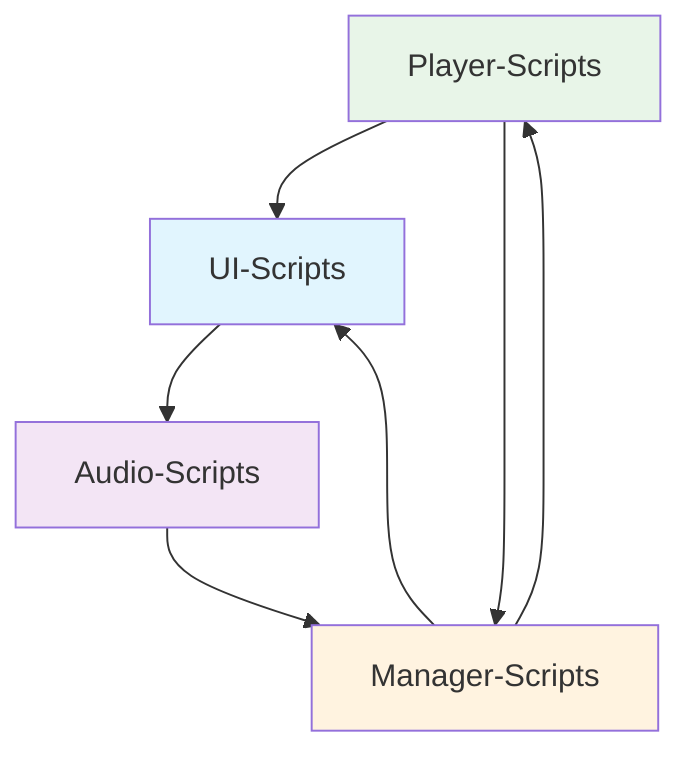
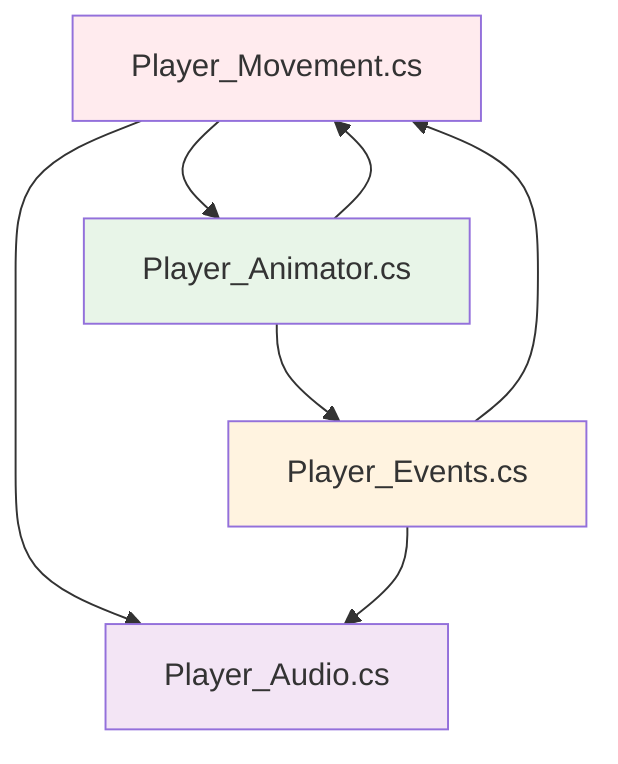
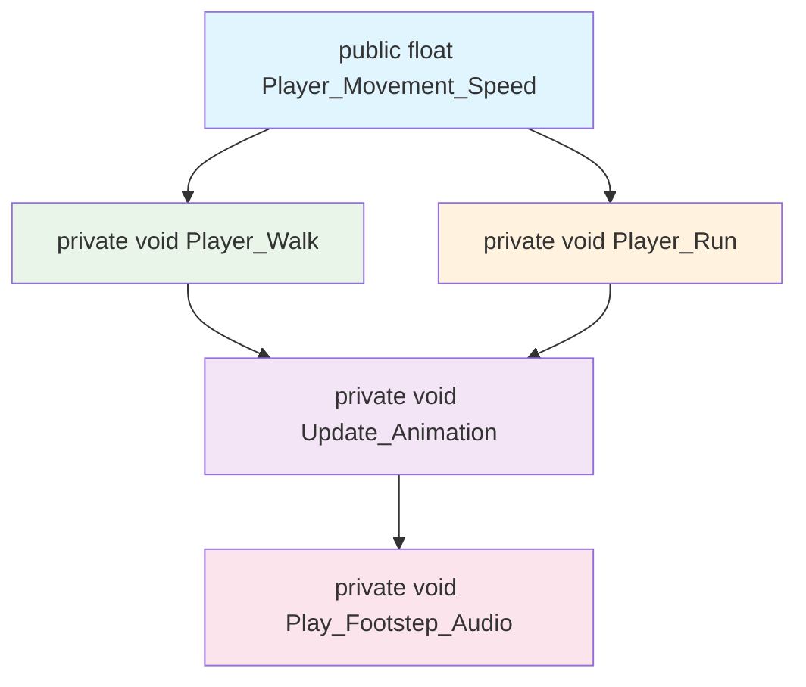

# Unity C# Code Style Standartları

## 📝 İsimlendirme Kuralları

### Class/Script İsimlendirmesi
**Format**: `Class_Name`

```csharp
public class Player_Movement : MonoBehaviour
public class Inventory_System : MonoBehaviour
public class UI_Manager : MonoBehaviour
```

### Fonksiyon İsimlendirmesi
**Format**: `Function_Name`

```csharp
public void Move_Player(Vector3 direction)
public float Calculate_Distance(Transform target)
public void Initialize_Audio_System()
private bool Check_Ground_Contact()
```

### Değişken İsimlendirme Sistemi

#### Public/Inspector Değişkenleri
**Format**: `Variable_Name`
- Inspector'da görünen tüm değişkenler
- Class'lar ve fonksiyonlar ile çakışmayı önler

```csharp
public int Movement_Speed = 10;
public float Jump_Force = 5.0f;
[SerializeField] private bool Is_Grounded = false;
```

#### Fonksiyon İçi Değişkenler
**Format**: `in_function_variable`
- Local scope değişkenler için kullanılır
- Kod okunabilirliğini artırır

```csharp
private void Calculate_Movement()
{
    float in_horizontal_input = Input.GetAxis("Horizontal");
    Vector3 in_movement_direction = new Vector3(in_horizontal_input, 0, 0);
}
```

---

## 🎛️ Inspector Düzenleme Standartları

### Header Kullanımı
Her sistem grubu header ile ayrılmalı ve `[Space]` ile boşluk bırakılmalıdır.

**Format Kuralı**:
```csharp
[Header("Sistem Adi ----------------------------------------------------------------")]
[Space]
```

#### Örnek Implementasyon
```csharp
[Header("Hareket Ayarlari --------------------------------------------------------------")]
[Space]
public float Movement_Speed = 10f;
public float Jump_Force = 15f;
public LayerMask Ground_Layer;

[Header("Animasyon Ayarlari ------------------------------------------------------------")]
[Space]
public Animator Player_Animator;
public string Walk_Animation_Name = "Walk";

[Header("Debug -----------------------------------------------------------------------")]
[Space]
[SerializeField] private bool Show_Debug_Gizmos = false;
[SerializeField] private bool Show_Movement_Logs = false;
```

### Debug Bölümü Standardı
Her script'te debug seçenekleri bulunmalıdır:

```csharp
[Header("Debug -----------------------------------------------------------------------")]
[Space]
[SerializeField] private bool Show_Debug_Gizmos = false;
[SerializeField] private bool Enable_Debug_Logs = false;
[SerializeField] private Color Gizmo_Color = Color.red;

private void OnDrawGizmos()
{
    if (!Show_Debug_Gizmos) return;
    
    Gizmos.color = Gizmo_Color;
    Gizmos.DrawWireSphere(transform.position, 1f);
}
```

### Serialization Etiketleri
Değişken görünürlük kontrolü için uygun etiketler kullanılmalıdır:

```csharp
[SerializeField] private float private_but_editable = 5f;    // Private ama Inspector'da görünür
[HideInInspector] public bool hidden_public_var = true;     // Public ama gizli
```

---

## 🏗️ Kod Organizasyon Standartları

### Region Kullanımı
Kodlar mantıksal gruplara ayrılmalıdır:

```csharp
#region Unity Lifecycle ----------------------------------------------------------------
private void Awake() { }
private void Start() { }
private void Update() { }
#endregion

#region Public Methods ------------------------------------------------------------------
public void Set_Movement_Speed(float newSpeed) { }
public void Jump_Player() { }
#endregion

#region Private Methods -----------------------------------------------------------------
private void Handle_Input() { }
private void Apply_Movement() { }
#endregion

#region Events --------------------------------------------------------------------------
private void OnTriggerEnter(Collider other) { }
private void OnCollisionEnter(Collision collision) { }
#endregion
```

### Fonksiyon Ayırıcıları
Her fonksiyon arasında yorum ayırıcı kullanılmalıdır:

```csharp
//*-----------------------------------------------------------------------------------------//
public void Move_Player(Vector3 direction)
{
    // Fonksiyon implementasyonu
}

//*-----------------------------------------------------------------------------------------//
public void Jump_Player()
{
    // Fonksiyon implementasyonu
}
```

> **Not**: Better Comments Extension kullanarak `/*` ile vurgu yapılabilir.

---

## 🎯 SOLID & OOP Uygulaması

### Single Responsibility Prensibi
Her class tek bir sorumluluğa sahip olmalı ve modüler yapıda tasarlanmalıdır.

#### Örnek Modüler Yapı:

**Player_Movement.cs**
```csharp
public class Player_Movement : MonoBehaviour
{
    public void Set_Movement_Speed(float new_speed)
        => Move_Speed = Mathf.Max(0f, new_speed);
    
    public void Move_To_Direction(Vector3 direction)
        => transform.Translate(direction * Move_Speed * Time.deltaTime);
}
```

**Player_Animator_Controller.cs**
```csharp
public class Player_Animator_Controller : MonoBehaviour
{
    public void Set_Bool(string paramName, bool state)
        => Player_Animator.SetBool(Animator.StringToHash(paramName), state);
    
    public void Trigger_Animation(string triggerName)
        => Player_Animator.SetTrigger(Animator.StringToHash(triggerName));
}
```

### Component Communication
State machine'ler ve objeler arası iletişim net referanslar ile sağlanmalıdır:

```csharp
public class Player_Controller : MonoBehaviour
{
    [Header("Component References --------------------------------------------------------")]
    [Space]
    public Player_Movement movement;
    public Player_Animator_Controller animator;
    public Player_Combat combat;
    
    //*---------------------------------------------------------------------------------//
    private void Handle_Movement()
    {
        movement.Move_To_Direction(input_direction);
        animator.Set_Bool("IsWalking", true);
    }
}
```

---

## 📊 Flowchart Dokümantasyon Sistemi

### Dokümantasyon Konumu
- **Konum**: `docs/` klasörü
- **Branch**: `docs` branch'i
- **Format**: Markdown (.md) uzantısı
---
### 1. Genel Yapı Flowchart'ı
Proje genelindeki script grupları arası ilişkiler:


---
### 2. Obje İçi Component İlişkileri
Tek bir GameObject içindeki component'ler arası bağlantılar:


---
### 3. Script İçi Fonksiyon Akışı
Tek script içindeki fonksiyon çağrı hiyerarşisi:



---

## 📋 Code Style Kuralları Özeti

### ✅ Yapılması Gerekenler

| Kategori | Format | Örnek |
|----------|--------|--------|
| **Class İsimlendirme** | `Class_Name` | `Player_Movement` |
| **Fonksiyon İsimlendirme** | `Function_Name` | `Move_Player()` |
| **Public Değişkenler** | `Variable_Name` | `Movement_Speed` |
| **Local Değişkenler** | `in_function_variable` | `in_input_value` |
| **Inspector Headers** | `[Header("Sistem ---")]` | Her grup için header |
| **Debug Bölümü** | Her script'te debug seçenekleri | `Show_Debug_Gizmos` |
| **Region Kullanımı** | Kodları mantıksal gruplara ayır | `#region Unity Lifecycle` |
| **Fonksiyon Ayırıcı** | `//*---*//` ile ayır | Her fonksiyon arası |

### ❌ Yapılmaması Gerekenler

- camelCase yerine underscore kullanmamak
- Header olmadan Inspector değişkenleri gruplamak
- Region kullanmadan uzun class'lar yazmak
- Debug seçenekleri olmayan production kodları
- Çoklu sorumluluk sahibi monolitik class'lar

---

## 🎯 Kalite Kontrol Listesi

Bu checklist her script tamamlandığında kontrol edilmelidir:

- [ ] Class ismi `Class_Name` formatında
- [ ] Fonksiyon isimleri `Function_Name` formatında
- [ ] Public değişkenler `Variable_Name` formatında  
- [ ] Local değişkenler `in_function_variable` formatında
- [ ] Inspector'da header'lar ve spacing mevcut
- [ ] Debug bölümü implementasyonu tamamlanmış
- [ ] Region'lar ile kod organize edilmiş
- [ ] Fonksiyon ayırıcıları eklenmiş
- [ ] SOLID prensiplerine uygun modüler tasarım
- [ ] İlgili flowchart dokümantasyonu oluşturulmuş
---
> **Not**: Bu standartlar Ethem Emre Özkan tarafından bireysel ve ufak ekip çalışmaları için bir temel oluşturulması amacıyla oluşturulmuştur.