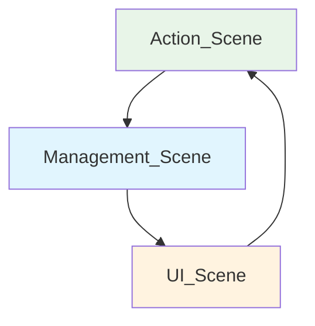

# Dokümantasyon Standartları ve Proje Dökümanları

## 📋 Oluşturulması Gereken Dökümanlar

### 1. **Game Design Document (GDD)**
- Demo ve Main versiyonları
- Temel oyun mekaniklerinin tanımlandığı doküman

### 2. **Flowchart Dokümantasyonu**
- Code Style'da belirtilen 3 tipte flowchart
- Sistem ilişkilerinin görsel temsilcisi

### 3. **TODO List**
- Prototip aşamasına kadar izlenecek adımlar
- Geliştirme sürecinin planlanması

### 4. **Proje Raporu**
- Proje bitiminde yazılan değerlendirme raporu
- Öğrenilen dersler ve zorluklar

### 5. **README.md**
- Projenin showcase dokümanı
- CV ve portfolyo için hazırlanmış sunum

---

## 🎮 Game Design Document Standartları

### GDD Versiyonlama Sistemi
Proje geliştirme aşamalarına göre iki ayrı doküman hazırlanır:

```
├── Game_Design_Docs/
    ├── Demo-GDD.md      # MVP/Prototype aşaması için
    └── Main-GDD.md      # Full production dokümantasyonu
```

### Demo GDD Özellikleri
- **Kapsam**: MVP ve Prototype aşamalarında kullanılır
- **İçerik**: 4-5 cümle ile temel açıklamalar
- **Görsel**: Bolca görsel içerik barındırır
- **Detay**: Minimum teknik detay

### Main GDD Özellikleri  
- **Kapsam**: Demo ve prototip sonrası detaylı versiyon
- **İçerik**: UI tasarımı, teknik detaylar dahil
- **Referans**: Demo GDD'den yapılan değişiklikleri içerir

### 📄 Demo GDD Örnek Referansı

Demo GDD hazırlanırken aşağıdaki referans doküman örnek alınmalıdır:

> **📁 Referans Doküman**: [`03-Docs/Elementory.pdf`](Example.pdf)

#### 📋 Referans Doküman Özellikleri
- **Format**: Demo GDD standart yapısı
- **İçerik**: 4-5 cümle ile temel açıklamalar
- **Görsel Düzen**: Başlık hiyerarşisi ve görsel öğeler
- **Kapsam**: MVP/Prototype seviyesi detay

#### 🎯 Örnek Alınacak Bölümler
1. **Başlık Formatları** - Hiyerarşik düzenleme
2. **İçerik Yoğunluğu** - Kısa ve öz açıklamalar  
3. **Görsel Entegrasyonu** - Diagram ve şema kullanımı
4. **Bölüm Organizasyonu** - Mantıksal içerik akışı

**Not**: Bu örnek doküman Demo GDD yazımında format, içerik yapısı ve görsel düzenleme konularında rehber olarak kullanılmalıdır.

---

## 📖 GDD Başlık Yapısı

### 1. Giriş
#### 1.1 Özet
Projenin 3-4 satırlık kısa özeti

#### 1.2 Başlık Listesi
Doküman içerisindeki tüm başlıkların listesi

### 2. Oynanış
#### 2.1 Temel Oynanış
Oyunun elevator pitch şeklinde kısa açıklaması. Okuyucunun aklında net bir görüntü oluşturacak metin.

#### 2.2 Oynanış Döngüsü
Flowchart ile görselleştirilmiş oyun döngüsü

**Örnek Döngü:**


#### 2.3 Oyunun Vurucu Noktası
Oyunu farklı kılan özellikler

**Örnek:**
- Grind sistemi yenilikçi ve farklı
- Envanter sistemi zorlu ve strategik

### 3. Mekanikler
Oyunun türüne göre mekaniklerin kısa, akılda canlandırılacak şekilde yazıldığı bölüm. Minimum düzeyde teknik detay barındırır.

---

## 📊 Flowcharts.md Dokümantasyonu

Bu doküman [Code Style Guide](../02-Code_Style/README.md)'da belirtilen flowchart türlerinin Markdown formatında tutulduğu dosyadır.

### Flowchart Türleri ve İsimlendirme

#### 1. Sistem Genel Yapısı
```
System_Architecture_Overview.md
```

#### 2. Obje İçi Component İlişkileri  
```
Object_Component_Relations.md
```

#### 3. Script İçi Fonksiyon Akışı
```
Script_Function_Flow.md
```

**Format Örneği:**
```markdown
# System Architecture Overview

## Player Systems Flow
[Mermaid diyagram buraya]

## UI Systems Flow  
[Mermaid diyagram buraya]
```

---

## ✅ TODO List Standardı

Prototip aşamasına kadar izlenmesi gereken adımların planlandığı doküman.

### TODO List Formatı
```markdown
# Project TODO List

## 🎯 Core Mechanics
- [ ] Player Movement System
- [ ] Basic UI Implementation  
- [ ] Game State Management

## 🎨 Art & Audio
- [ ] Character Sprites
- [ ] Background Music
- [ ] Sound Effects

## 🧪 Testing & Polish
- [ ] Prototype Testing
- [ ] Bug Fixes
- [ ] Performance Optimization

## 📅 Milestones
- **Week 1**: Core mechanics completion
- **Week 2**: Art integration
- **Week 3**: Testing and polish
```

---

## 📈 Proje Raporu

Her proje bitiminde oluşturulan değerlendirme raporu.

### Rapor İçeriği
```markdown
# Project Report: [Proje Adı]

## 🎯 Proje Özeti
[Projenin kısa açıklaması]

## 💡 Ne Öğrendim?
- Teknik beceriler
- Tasarım prensipleri
- Proje yönetimi

## 🚀 Nasıl Geliştim?
- Kod kalitesi
- Problem çözme
- Zaman yönetimi

## 🔥 Nerede Zorlandım?
- Karşılaşılan zorluklar
- Çözüm yolları
- Gelecekte kaçınılacak hatalar

## 📊 Teknik Detaylar
- Kullanılan teknolojiler
- Architecture kararları
- Performance optimizasyonları
```

---

## 🌟 README.md Standardı

Proje tamamlandıktan sonra ana dizine eklenen showcase dokümanı.

### README.md İçeriği
```markdown
# [Proje Adı]

## 🎮 Oyun Hakkında
[Kısa açıklama ve GDD benzeri içerik]

## 🎯 Özellikler  
- Feature 1
- Feature 2
- Feature 3

## 🎬 Görseller


## 🔗 Linkler
- [🎮 Itch.io](link)
- [🎯 Steam](link) 
- [📱 Google Play](link)

## 🛠️ Teknik Detaylar
- **Engine**: Unity 2022.3
- **Platform**: PC/Mobile
- **Geliştirme Süresi**: X hafta

## 👨‍💻 Geliştirici
**[İsim Soyisim]**
- 📧 Email: [email]
- 💼 LinkedIn: [linkedin]
- 🐱 GitHub: [github]
```

---

## 📁 Docs Klasör Hiyerarşisi

```
Project_Folder/
├── README.md                          # Sonda eklenecek
├── Assets/
├── Packages/
└── Docs/
    ├── Game_Design_Docs/
    │   ├── Demo-GDD.md
    │   └── Main-GDD.md
    ├── Flowcharts/
    │   ├── System_Architecture.md
    │   ├── Component_Relations.md
    │   └── Function_Flows.md
    ├── Todo_Lists/
    │   ├── Sprint_1_TODO.md
    │   ├── Sprint_2_TODO.md
    │   └── Final_TODO.md
    └── Project_Report/
        └── Final_Report.md
```

---

## 🎯 Dokümantasyon Kuralları Özeti

### ✅ Yapılması Gerekenler

| Doküman Türü | Timing | İçerik |
|--------------|--------|--------|
| **Demo GDD** | Proje başlangıcı | 4-5 cümle, görsel ağırlıklı |
| **Main GDD** | Prototype sonrası | Detaylı teknik içerik |
| **Flowcharts** | Kod yazım aşaması | 3 tip flowchart |
| **TODO List** | Sprint planlaması | Haftalık milestone'lar |
| **Rapor** | Proje bitimi | Öğrenilen dersler |
| **README** | Release öncesi | Portfolio showcase |

### ❌ Yapılmaması Gerekenler

- Demo GDD'yi aşırı teknik detayla doldurmak
- Flowchart'ları güncellemeden bırakmak  
- TODO listesini takip etmemek
- README'yi proje başında yazmak
- Raporu atlayarak projeyi bitirmek

---

## 📝 Kalite Kontrol Listesi

Her proje için aşağıdaki dökümanlar tamamlanmalıdır:

- [ ] Demo GDD yazıldı ve onaylandı
- [ ] Flowchart'lar kod ile senkronize edildi
- [ ] TODO list düzenli güncellendi
- [ ] Main GDD prototype sonrası hazırlandı
- [ ] Proje raporu detaylı şekilde yazıldı
- [ ] README.md portfolio kalitesinde hazırlandı
- [ ] Docs klasör hiyerarşisi doğru oluşturuldu
---
> **Not**: Bu standartlar Ethem Emre Özkan tarafından bireysel ve ufak ekip çalışmaları için bir temel oluşturulması amacıyla oluşturulmuştur.