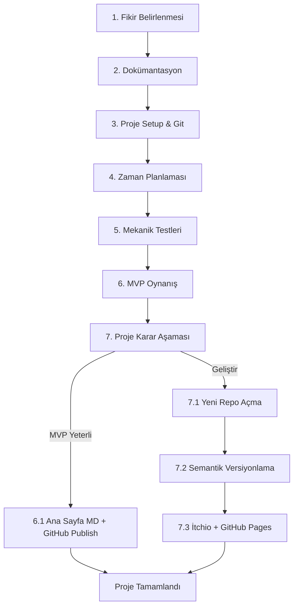

# Proje Workflow ve Aşamaları

## 🎯 Proje Geliştirme Süreç Akışı

Unity oyun geliştirme projelerinin başlangıçtan bitişe kadar izlenmesi gereken sistematik aşamalar.

---

## 📋 Proje Aşamaları

### 1. Fikir Belirlenmesi

Proje konseptinin netleştirilmesi ve kapsamın belirlenmesi aşaması.

**Fikir Seçim Kriterleri:**
- Teknik beceri seviyesine uygunluk
- Tahmini geliştirme süresinin realistik olması
- Portfolio değerine katkı potansiyeli
- Kişisel motivasyon ve ilgi seviyesi

### 2. Dokümantasyon

#### Dual Documentation Sistemi
Dokümantasyon iki ayrı lokasyonda tutulur:

**00-EEO_Projects Klasörü:**
- Global proje veritabanı
- Proje karşılaştırmaları ve analizler
- Cross-project referanslar

**Repository İçi Docs/ Klasörü:**
- Proje özel dokümantasyon
- Geliştirme sürecine özgü belgeler
- [Dokümantasyon Standartları](03-Documentation_Standards.md) uygulanır

**Hazırlanması Gereken Dökümanlar:**
- Demo-GDD.md
- Flowchart documentation
- TODO list (prototip aşamasına kadar)

### 3. Proje Dosya Hiyerarşisi Oluşturulması ve Git-Github Kurulumu

#### Klasör Yapısı
[Proje Klasör Mimarisi](04-Project_Architecture.md) standartlarına uygun setup:

```
Project_Root/
├── Assets/
├── Docs/
├── .gitignore
└── README.md
```

#### Git Setup
- [Git Workflow](01-Git_Workflow.md) standartlarına uygun branch yapısı
- Initial commit: "main: Project Created"
- GitHub repository oluşturma ve remote bağlantısı

### 4. Zaman Planlaması

**Sprint Yapısı:**
- Week 1: Mekanik testleri
- Week 2: MVP implementasyon
- Week 3: Polish ve bug fix
- Week 4: Dokümantasyon ve release hazırlığı

**Milestone Tanımları:**
- Alpha: Core mechanics çalışır durumda
- Beta: Complete gameplay loop
- MVP: Minimum viable product
- Release: Dokümante edilmiş ve polished

### 5. Mekanik Testleri

**Test Sahneleri Organizasyonu:**
```
Assets/Scenes/Test_Scenes/
├── Mechanic_Tests/
└── Integration_Tests/
```

**Test Başarı Kriterleri:**
- Core mechanics working
- Performance acceptable
- User input responsive
- Basic feedback systems implemented

### 6. MVP Seviye Oynanış

**MVP Tanımı:**
- En temel oynanabilir versiyon
- Core gameplay loop complete
- Basic UI implementasyonu
- Win/Lose conditions defined

**MVP Completion Checklist:**
- Oyun start ve finish edilebilir
- Core mechanics functional
- Major bugs resolved
- Performance playable level

### 7. Proje Karar Aşaması

MVP tamamlandıktan sonra proje geleceği için karar verilir:

**Soru: Yeterli mi? Geliştirilmeli mi?**

---

## 🔀 Karar Sonrası Workflow Dalları

### 6.1 MVP Seviyede Kalma Kararı

Proje MVP seviyesinde bitirilirse:

#### Ana Sayfa MD Hazırlanması
- README.md portfolio kalitesinde hazırlanır
- [Dokümantasyon Standartları](03-Documentation_Standards.md) README format'ı uygulanır
- Gameplay screenshots/GIFs eklenir
- Developer contact bilgileri eklenir

#### Github Publish Adımları
- Repository cleanup
- dev -> main final merge
- Public visibility
- Release tag creation

### 7.1 Proje GreenLight Aldıysa

#### Yeni Repo Açılması
- Production-ready naming convention
- [Git Workflow](01-Git_Workflow.md) full implementation
- Advanced branching strategy

### 7.2 Semantik Versiyonlama

**Version Schema:** `MAJOR.MINOR.PATCH`

- **MAJOR**: Game mechanics değişiklikleri
- **MINOR**: Yeni feature additions
- **PATCH**: Bug fixes ve küçük iyileştirmeler

**Versioning Examples:**
```
v0.1.0 - Initial MVP
v0.2.0 - First feature addition
v0.2.1 - Bug fixes
v1.0.0 - First stable release
```

### 7.3 İtchio ve Github Sayfaları

#### İtchio Sayfası Oluşturma
- Game page creation
- Asset preparation (screenshots, GIFs)
- Metadata optimization
- Pricing strategy

#### Github Sayfaları
- GitHub Pages activation
- Documentation hosting
- WebGL builds hosting
- Download links management

---

## 🔄 Workflow Akış Şeması



---

## 📋 Workflow Kuralları Özeti

### ✅ Yapılması Gerekenler

| Aşama | Ana Aktivite | Çıktı |
|--------|-------------|--------|
| **Fikir** | Konsept netleştirme | Project brief |
| **Dokümantasyon** | GDD ve flowchart | Docs/ complete |
| **Setup** | Klasör yapısı ve Git | Working repo |
| **Planlama** | Sprint ve milestone | Schedule |
| **Test** | Mechanic validation | Test scenes |
| **MVP** | Core gameplay | Playable game |
| **Karar** | Go/No-go decision | Next steps |

### ❌ Yapılmaması Gerekenler

- Dokümantasyon aşamasını atlama
- Git commit'lerini düzensiz yapma
- Zaman planlamasını unrealistic tutma
- MVP aşamasında scope creep
- Karar aşamasında uzun süre bekleme

---

## 🎯 Branch Mantığı ve Proje İlişkisi

Her proje aşaması [Git Workflow](01-Git_Workflow.md) ile uyumlu şekilde ilerler:

- **main**: Stabil, release-ready kod
- **dev**: Aktif geliştirme
- **feat/**: Her mekanik ayrı branch
- **docs**: Dokümantasyon güncellemeleri

**Proje Aşamaları Branch Kullanımı:**
- Aşama 1-4: main ve docs branch'leri
- Aşama 5-6: dev ve feat/ branch'leri aktif
- Aşama 7: release preparation, main merge

---

> **Not**: Bu standartlar Ethem Emre Özkan tarafından bireysel ve ufak ekip çalışmaları için bir temel oluşturulması amacıyla oluşturulmuştur.